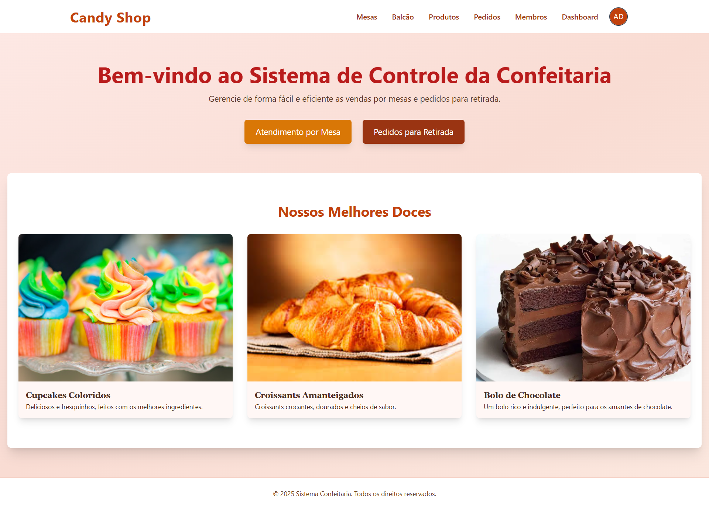
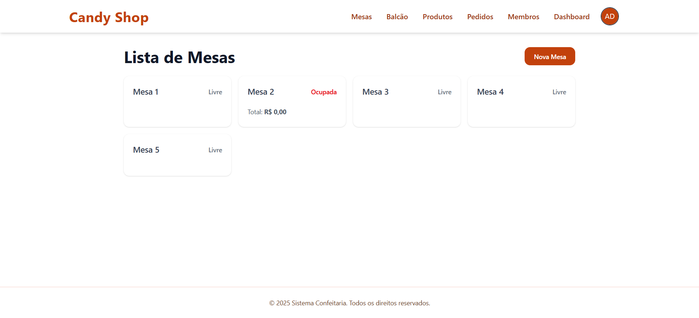
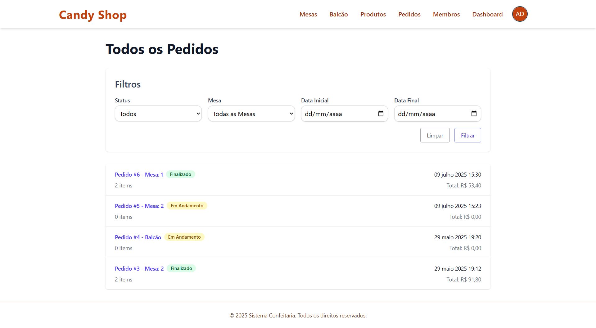
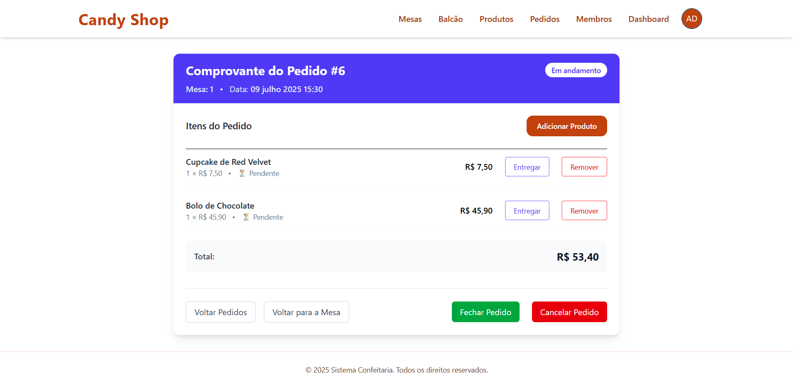
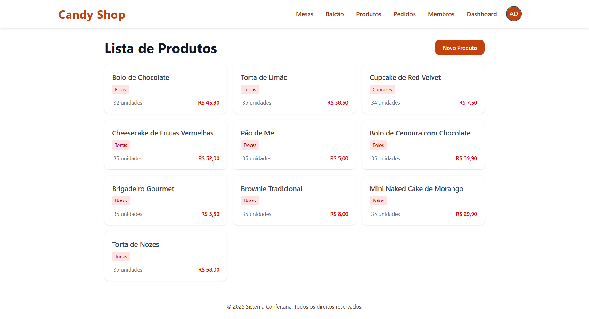
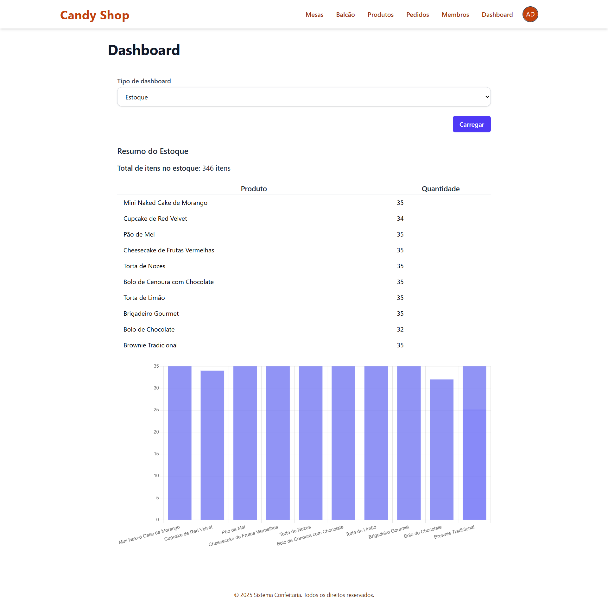
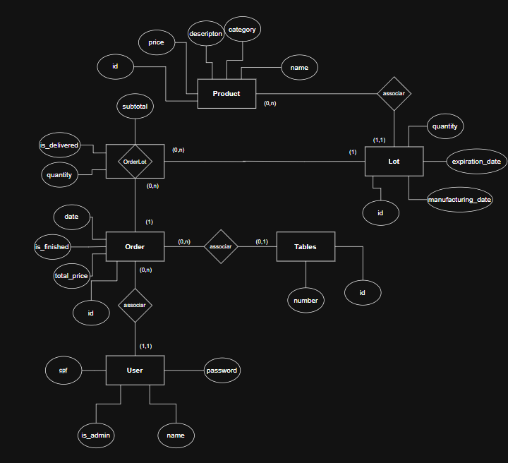

<p align="center">
  
</p>

# Candy Store App 🍰


<p align="center">
  
</p>

<details>
  <summary>Clique para visualizar mais imagens</summary>
  <div style="display: flex; justify-content: center; gap: 20px;">
    
    
  </div>
  
  <br>
  
  <div style="display: flex; justify-content: center; gap: 20px;">
    
    
    
  </div>
</details>

## Descrição
Projeto feito por **Anderson Passos, Jônatas Duarte , Francisco Colatino, Rayane Quézia, Thallys Alcantara** para a disciplina de **Engenharia de Softare** pelo **4º período da Universidade Federal de Alagoas**.


## Visão Geral

O **Candy Store App** é um sistema web de gestão para confeitarias, focado em controle de pedidos, gestão de estoque via lotes, gerenciamento de produtos e atendimento a clientes em mesas ou no balcão. Foi desenvolvido utilizando Ruby on Rails com renderização de views no servidor e autenticação via JWT.

---

## Finalidade do Projeto

Este projeto foi desenvolvido como trabalho da disciplina de **Engenharia de Software** do curso de **Ciência da Computação da Universidade Federal de Alagoas**. Ele tem como objetivo aplicar os conceitos aprendidos em um sistema completo com boas práticas de desenvolvimento, autenticação segura, testes automatizados e arquitetura escalável.

---

## Diagrama UML (Entidade-Relacionamento)

<details>
  <summary>Clique para visualizar o diagrama UML</summary>

   <p align="center">
    
  </p>
</details>

---

## Funcionalidades

- **Usuários (Admin e Atendentes)**:
  - Cadastro, login, edição, exclusão e alteração de senha.
  - Controle de permissões com base no papel (RBAC).

- **Gestão de Produtos**:
  - Cadastro, edição, exclusão e listagem de produtos.
  - Associação com lotes.

- **Lotes de Produção**:
  - Registro de data de fabricação, validade e quantidade.
  - Rastreabilidade dos produtos vendidos.

- **Pedidos**:
  - Criação de pedidos vinculados a mesas ou balcão.
  - Controle de status (pendente, entregue, fechado).
  - Adição e remoção de itens por lote.

- **Mesas**:
  - Cadastro e gestão de mesas.
  - Vinculação e liberação de pedidos.

- **Dashboard**:
  - Indicadores de estoque, lotes, pedidos ativos e relatórios administrativos.

- **Autenticação com JWT**
  - Controle seguro de acesso e proteção de rotas sensíveis.

---

## Tecnologias Utilizadas

- **Backend**: Ruby on Rails (MVC)
- **Frontend**: Embedded Ruby (ERB), TailwindCSS
- **Banco de Dados**: PostgreSQL
- **Autenticação**: JSON Web Token (JWT)
- **Testes**: RSpec, FactoryBot, Faker, SimpleCov, Shoulda Matchers
- **Containers**: Docker, Docker Compose
- **Gerenciamento**: GitHub, Trello

---

## Endpoints

### Sessões
- `POST /login` – Login do usuário.
- `GET /logout` – Logout do usuário.

### Usuários
- CRUD completo: `/users`
- Alterar senha: `PATCH /users/:id/update_password`

### Produtos
- CRUD completo: `/products`

### Lotes
- CRUD aninhado: `/products/:product_id/lots`

### Mesas
- CRUD completo: `/tables`

### Pedidos
- `GET /orders`
- `POST /orders`
- `POST /orders/:id/close_order`

### Balcão
- `GET /delivery` – Visualizar pedidos sem mesa.

### Dashboard
- `GET /dashboard`

---

## Fluxo Central da Aplicação

1. Login com autenticação JWT.
2. Cadastro de produtos e lotes.
3. Criação de mesas.
4. Atendimento ao cliente (via mesa ou balcão).
5. Adição de produtos ao pedido por lote.
6. Atualização do status dos produtos.
7. Fechamento do pedido e liberação da mesa.
8. Acompanhamento pelo dashboard.

---

## Instalação e Configuração

### Pré-requisitos

- Ruby 3.3.5
- Rails 7
- PostgreSQL
- Docker (opcional)

### Passos

1. Clone o repositório:
   ```bash
   git clone https://github.com/franciscocolatino/Candy-store-app.git
   cd Candy-store-app
    ```
2. Subindo o container Docker

  Para iniciar o ambiente da aplicação usando Docker Compose, execute:
  
  ```sh
  docker-compose up
  ```

Para rodar em segundo plano (modo detached):

  ```sh
  docker-compose up -d
  ```

3. Acessando o console do Rails (rails c)

  Para acessar o console do Rails dentro do container:
  
  ```sh
  docker-compose exec app rails c
  ```

4. Criando e migrando o banco de dados

  Para criar, migrar e popular o banco de dados com dados iniciais:
  
  ```sh
  docker-compose exec app rails db:prepare
  ```

  Para rodar as migrações:
  
  ```sh
  docker-compose exec app rails db:migrate
  ```

## Parando/derrubando os containers

Para parar os containers:

```sh
docker-compose down
```

## Outros comandos úteis

- Para acessar o bash do container:

  ```sh
  docker-compose exec app bash
  ```

- Para ver os logs em tempo real:

  ```sh
  docker-compose logs -f app
  ```

- Para recriar, migrar e popular o banco de dados com dados iniciais
  ```sh
  rails db:drop db:create db:migrate db:seed
  ```
